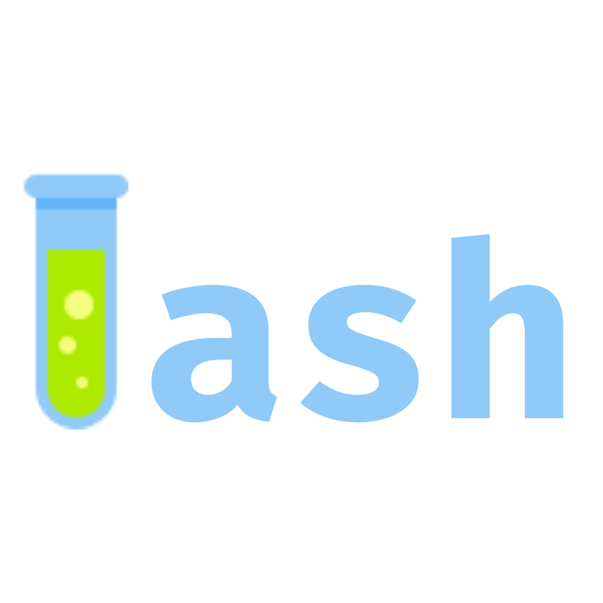

***T***est ***A***utomation for ***SH***ell

 

 

## What is Tash?

Tash is a tiny, lightweight testing framework (1 file!) that is [POSIX-compliant](https://en.wikipedia.org/wiki/POSIX) and has zero dependencies. Its main goal is to
be runnable on every system that has a POSIX shell(Bash, Dash, Zsh, Ksh, ...). 

That is pretty much it. It allows you to write tests, in a portable manner. It is pure shell, so zero dependencies.

<!-- ## Why choose Tash? -->
<!---->
<!-- If you want portable tests, zero dependencies, a tiny footprint, a fast startup, and a nice UX, Tash is probably for you. -->
<!-- However, if you need more advanced features or are working with a large codebase, Tash may not be the right choice. -->

## Advantages of Tash
- Anyone with your repo cloned can run tests immediately
- Has a nice UX
- One file, "source it and go"
- You get to write tests

## Disadvantages of Tash
- Limited feature set
- You get to write tests

## Installation
<!-- coming soon -->

## TODO

- [ ] TAP/Junit compatibility for CI
- [ ] Make documentation

